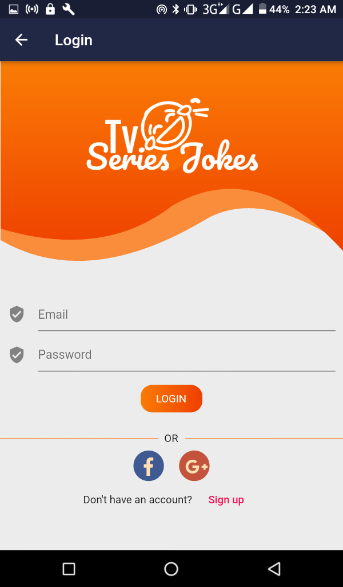
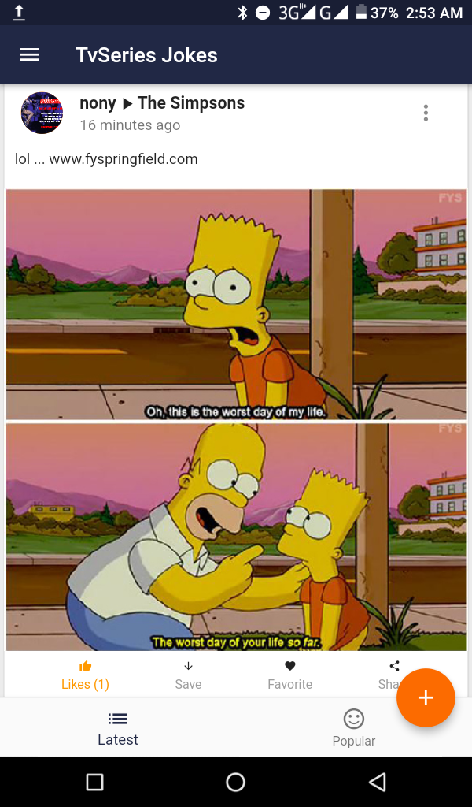
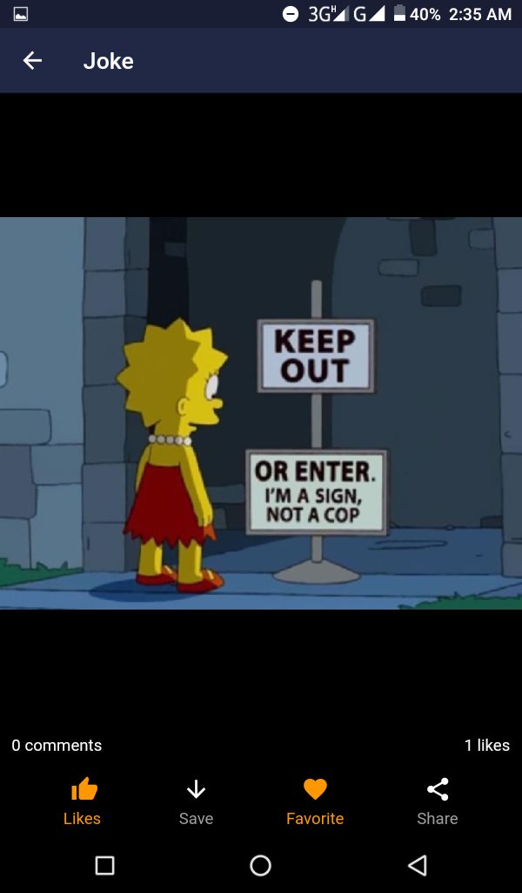
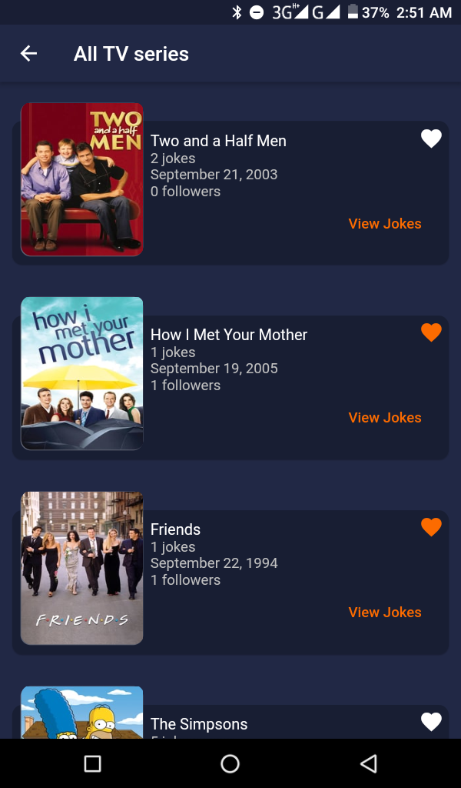
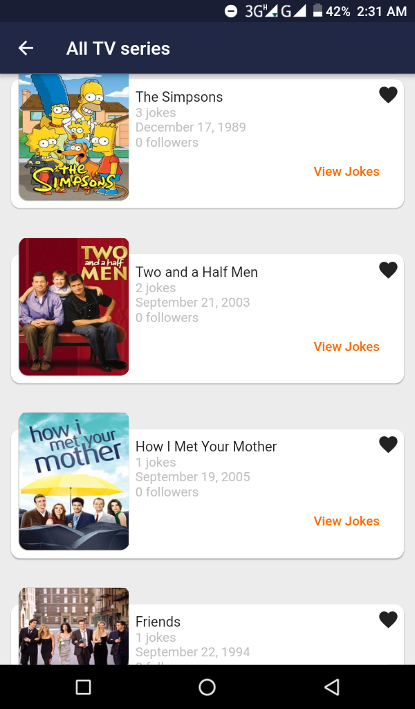
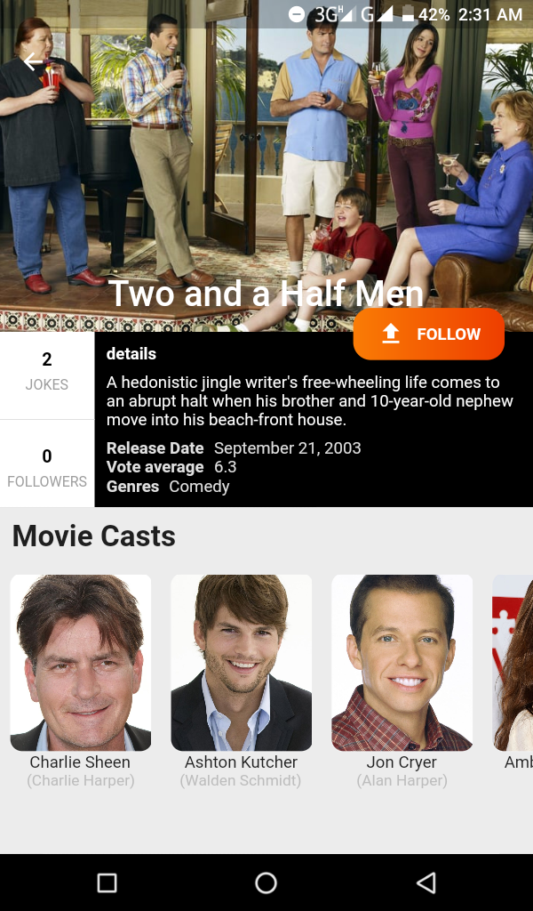

# tv-series-jokes

A Flutter android application for sharing jokes from your favorite tv series with friends. Helps you download jokes shared by your friends and also add them to you favorite collection.   

* [Link to playstore](https://play.google.com/store/apps/details?id=com.nonybrighto.tv_series_jokes)
* [Demo video](https://youtu.be/XqmtX380cz0)
* [Server side express REST API](https://github.com/nonybrighto/tv-series-jokes-api)

## Features

* Flutter BLoC pattern
* Infinite scroll
* Take screenshot of joke's card widget
* Cached network image
* Download cached image
* Share text and images
* Dark and Light Theme
* Social Authentication

## Screenshots  

N:B This application is configured to work on android devices. I currently don't own a mac :-)

##dependencies

* esys_flutter_share
* cached_network_image
* dio
* built_value
* zoomable_image
* flutter_typeahead

##Mentions

* https://github.com/kserko/CineReel - Flutter TMDB movie application.
* https://www.websitepolicies.com - Website policy generator.
* https://www.freelogodesign.org - Make free logos here.